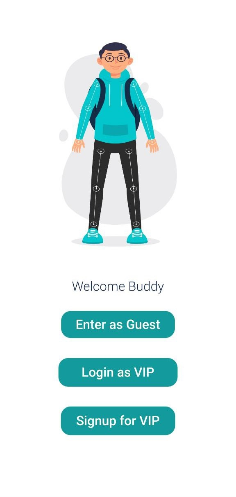
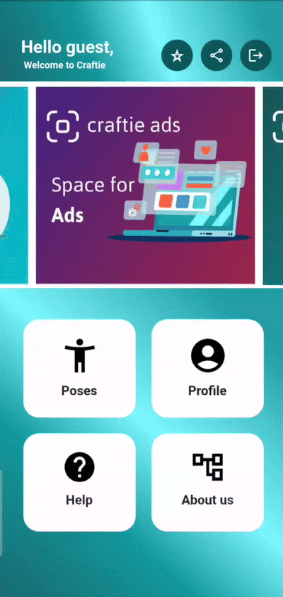
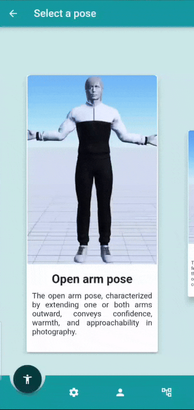

# Craftie - Pose correction app 

Craftie is a multiplatform app which can be used to correct the poses when giving poses for the photoes.(This is a prototype only).

Screenshots :

Functions that can be done,

- Detect the posture of the person in realtime.
- Give realtime feedback to correct the pose.(Both audio and text feedback)
- User can enable auto-capture,so that the camera will take picture automatically when the correct pose comes.
- User can take photoes manually also.
- Two account types (Guest account and VIP account)

When building this project,we used the following technologies,

- Android studio
- Flutter
- Firebase auth
- Figma
- Google's ML kit 
